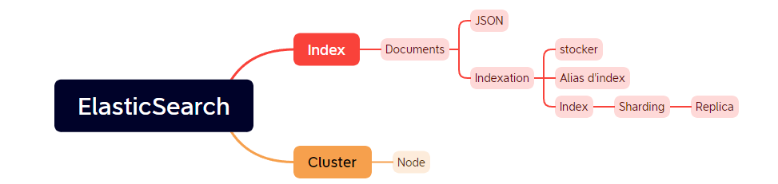
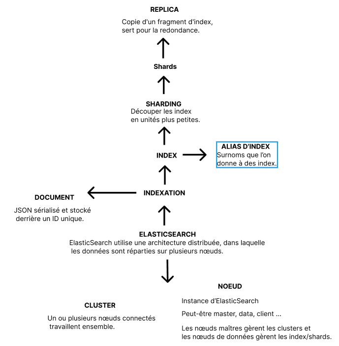
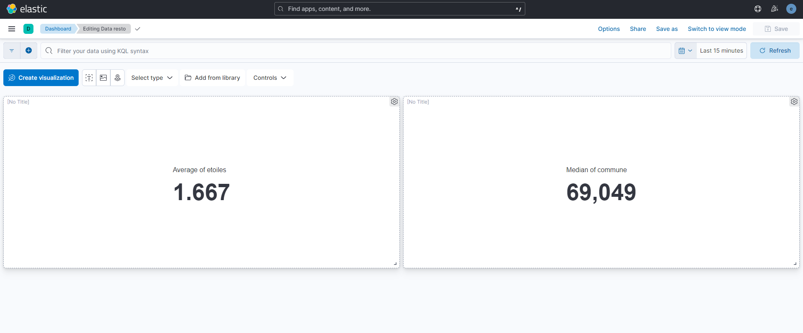
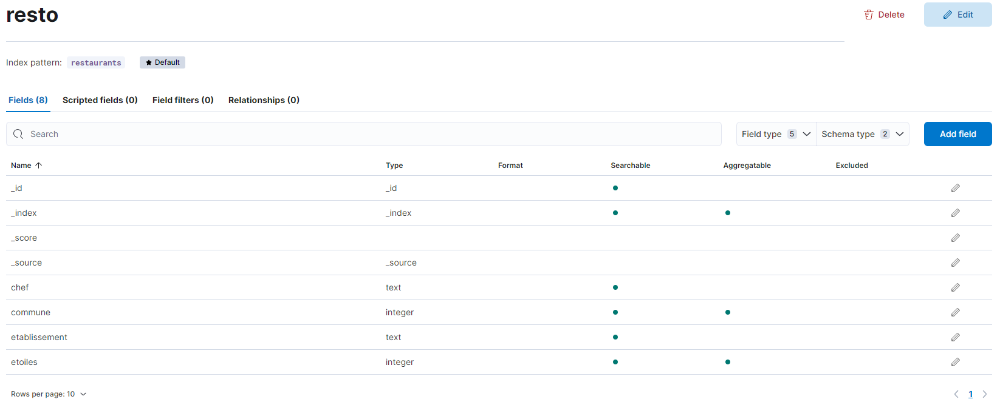

# ElasticSearch

## Installer le projet

Télécharger ElasticSearch et Kibana

Créer un index (via Kibana Dev tools console par exemple)
Définir la structure du mapping

```
PUT /restaurants
{
    "mappings": {
        "properties": {
            "chef": {
                "type": "text"
            },
            "commune": {
                "type": "text"
            },
            "etablissement": {
                "type": "integer"
            },
            "etoiles": {
                "type": "integer"
            }
        }
    }
}
```

Exemple d'ajout d'un restaurant

```
POST /restaurants/_doc/
{
  "chef": "Chef Dupont",
  "commune": "69002",
  "etablissement": Etablissement deluxe,
  "etoiles": 3
}

```

Récupérer tous les restaurants

```
GET /restaurants/_search
```

Ajout bulk

```
POST /restaurants/_bulk
{ "index" : { } }
{ "chef": "Père Ducros", "commune": "69008", "etablissement": Le Cordon Bleu, "etoiles": 3 }
{ "index" : { } }
{ "chef": "Chef Damien", "commune": "69007", "etablissement": 2, "750g": 2 }
```

## TP1

Voir branches
[day1](https://github.com/LouisMaupas/elasticsearch/tree/day1)
[day2](https://github.com/LouisMaupas/elasticsearch/tree/day2)
[day2.2](https://github.com/LouisMaupas/elasticsearch/tree/day2.2)

### Installation d’ElasticSearch, Kibana et Logstash

### Questions

- _Comment Elasticsearch procède-t-il au mapping ?_

Il peut-être explicte ou dynamque.

> **mapping explicite** : définir soi-même qu'un champ est de type date, un autre champ est de type texte

> **mapping dynamique** : Elasticsearch tente de deviner le type de données de chaque champ en fonction des premières données qu'il rencontre.

- _Peut-on modifier le mapping sans recréer l’index ?_

Non on peut seulement ajouter des champs.

- _Tentez de définir : Tokenisation et Normalisation_

> La **tokenisation** dans Logstash se réfère au processus de découpe d'un texte en unités plus petites appelées "tokens". Par défaut cela s'effectue sur les espaces, les tirets ... Dans le pipeline de Logstash, la tokenisation est réalisée à l'aide "grok". On retrouve ce processus avec chatGPT par exemple.

> La **Normalisation** : ça consite à standardiser le texte pour le rendre plus facilement comparable. Par exemple enlever les majuscules, appliquer des synonymes ... Voir Stemming (réduire les mots à leur forme racine, ou "stem". Par exemple "running" => "run").

## TP2

Voir branches [day2](https://github.com/LouisMaupas/elasticsearch/tree/day2) et [day2.2](https://github.com/LouisMaupas/elasticsearch/tree/day2.2)

### Questions

- _expliquer comment les données indexées sont analysées https://www.elastic.co/guide/en/elasticsearch/reference/current/analysis-lang-analyzer.html_

- _En fonction des données que vous déciderez de fournir déterminez une méthode adaptée d’indexation et de récupération de données_

## TP3

Voir branches [day3](https://github.com/LouisMaupas/elasticsearch/tree/day3) et [summary](https://github.com/LouisMaupas/elasticsearch/tree/summary)

### Schéma global

#### Recap



#### Detail



### Questions

- _Comment Elasticsearch stocke ses données et comment certaines de ces notions permettent de gagner en robustesse (en termes de sauvegarde et d’intégrité des données) ?_

Elasticsearch stocke ses données dans des index.

> Un **index** est une collection de documents similaires.

> Un **document** est une collection de champs, qui servent à stocker des données. Chaque champ a son propre type de données et contient les données réelles pour cet attribut du document.

Pour assurer la robustesse en termes de sauvegarde et d'intégrité des données, Elasticsearch propose plusieurs fonctionnalités dont la réplication, le sharding, les snpashot la restauration et la vérification de l'intégrité.

> **Réplication** : répliquer les index sur plusieurs nœuds au sein d'un cluster. Cela permet de créer des copies redondantes des données.

> **Shard** : Les index dans Elasticsearch sont divisés en plusieurs fragments (shards). Ce sont des unités autonome contenant une partie des données de l'index. Ceci permet une distribution équilibrée des données sur plusieurs nœuds du cluster.

> **Snapshot et restauration** : Cela permet de sauvegarder régulièrement les données et de les restaurer en cas de besoin.

> **Vérification de l'intégrité** : Elasticsearch vérifie l'intégrité des données stockées.

- _Résumer les fonctionnalités de mise à l’échelle_.

Pour améliorer la performence de traitement des données, les fonctionnalités de mise à l'échelle sont comme vu précédemen le sharding (toujours avoir plus de shards que de noeuds, c'est l'unité de base du scaling mais attention à ne pas en avoir trop), les index, les alias. Mais aussi la réplication et les clusters.

ElastisSearch permet aussi la fédération, l'équilibrage des charges ainsiq que la mise en cache et le routage.

> **Fédération** : c'est des clusters de clusters.

> **Équilibrage des charges** : c'est répartir les shards et les réplicas sur les nœuds du cluster pour équilibrer la charge de travail.

> **Routage** : On peut configurer un routage pour cibler directement un ensemble réduit d'informations.

#### B. La Scroll API

*https://www.elastic.co/guide/en/elasticsearch/reference/current/scroll-api.html D’après vos recherches pourquoi l’utiliser ? Est-ce le bon paramètre de recherche pour effectuer de la recherche paginée ?*

L'API Scroll d'Elasticsearch est principalement utilisée pour récupérer de grandes quantités de données d'un index sans utiliser une recherche paginée.

Non, ce n'est pas un bon paramètre pour effectuer de la recherceh paginée car elle prends un snapshot ça ne reflete donc pas la réalité des données. Son intéret c'est justement de récupérer beaucoup de données d'un coup.

#### C. Kibana

- _Quel est l’usage principal de Kibana ?_

La visualition de données.

- _Qu’est-ce qu’un Dashboard ? https://www.elastic.co/fr/kibana/kibana-dashboard_

C'est la combinaisaon de plusieurs visualisations en un seul tableau de bord pour avoir une vue d'ensemble de vos données.

- dataview



- dashboard


